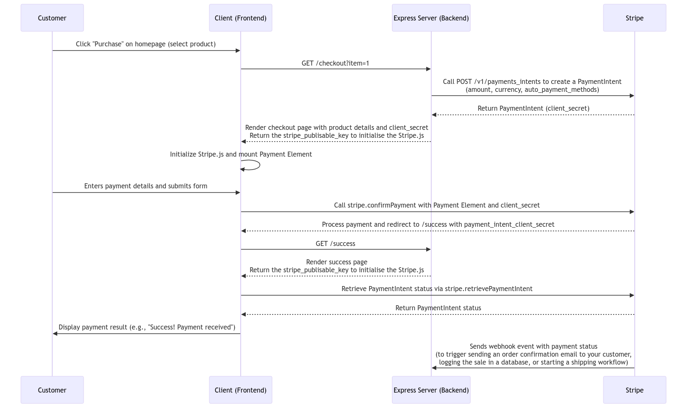

# Take home project

This is a simple e-commerce application that a customer can use to purchase a book, but it's missing the payments functionality — your goal is to integrate Stripe to get this application running!

## Candidate instructions

You'll receive these in email.

## Application overview

This demo is written in Javascript (Node.js) with the [Express framework](https://expressjs.com/). You'll need to retrieve a set of testmode API keys from the Stripe dashboard (you can create a free test account [here](https://dashboard.stripe.com/register)) to run this locally.

We're using the [Bootstrap](https://getbootstrap.com/docs/4.6/getting-started/introduction/) CSS framework. It's the most popular CSS framework in the world and is pretty easy to get started with — feel free to modify styles/layout if you like.

To simplify this project, we're also not using any database here, either. Instead `app.js` includes a simple switch statement to read the GET params for `item`.

To get started, clone the repository and run `npm install` to install dependencies:

```
git clone https://github.com/nclsprsn/stripe-solution-architect-takehome-project && cd sa-takehome-project-node
npm install
```

Rename `sample.env` to `.env` and populate with your Stripe account's test API keys.

- [API Keys](https://docs.stripe.com/keys) (secret_key and publishable_key)
- [Setup the webhook](https://docs.stripe.com/webhooks) (webhook_secret)

Then run the application locally:

```
npm start
```

Navigate to [http://localhost:3000](http://localhost:3000) to view the index page.

## The payment process



[Link to the diagram](https://mermaid.live/edit#pako:eNqtVMtu2zAQ_JUtTw6g2MhVaFPAjlvkUNSIfCoEGDS1llhTpMqHUzfIv3dJSbGdpLf6Ykkczu7MPp6YMBWynDn8FVALvJO8trwtNdCv49ZLITuuPSyAO1gE502L9u3xPB0rifQ8-WKN9qirq7e4IuKWvzuLzkGB9oAWJnMu9v-AryO-8FZ2WOr-fHF9ezvPYzCxh5KtghUNd1gyMBoaSq_jNcLEoULhobOmCsIP3HO6W-TwdbmGmWhQ7E3wn6XH9tNNDygiYE3sXClYfaf4s8PNrOPHlpS5jYy6vANvQFjkHoHDqj-8T0cft_Z2wlsTtM9ABGvJ1GMGPHizGVg2LfrGVG5IqVhf90k9oA9WX9LBRCRPNw4p3qiiuO4teCDTyL9RCCThj9I3o2qo0HOpHHBdwQVTzHMI6BsElxzedGGrpONbhZs9HqNKqaWXnD5iwvWVmP50Jzspj_sB9OcMkEImH0ZFsFQY_y-quCSZ1sFgzUW-LmxbSV7vjG3PqjcWp095KozeSduOMZL6VwHfqj93npJYWSNiP45ZRLzFStrYQGTCzAWRAL23Qxn7Xti8Q3zeZcPVdws30sa6_b-CRIeIyUo84Ktucp774OAg-WifHYAXuFf2vNuYPdUp6iKHO-k6xY8vNtKMB0UtjNN6mtGkFr3cDy_1IX9RHrAq2WkWknMF-UNu47YxZg-U3ljZkbqPnoaNPCEJdR39pGtS11Q_MDZNRt8c3EtaDdhSa0ULjybQ0bDKskiiTF3Hi8l5rpBcpsGuuOdb2iwZscWItJYiObhGdl18fDR2v1Pm8YpljKiIv6JV-hS1lIy4WlpKOT1WuOPkRMlK_UzQuAyKoxYs9zZgxqwJdcPyHVcUi4WO4o57-OUrbcMfxpzeqTu9sd_65Z12-PNfEq4DqA)

## Ressources

The ressources used in this project :

- [Accept a Payment](https://docs.stripe.com/payments/accept-a-payment?platform=web&ui=elements#web-post-payment)
